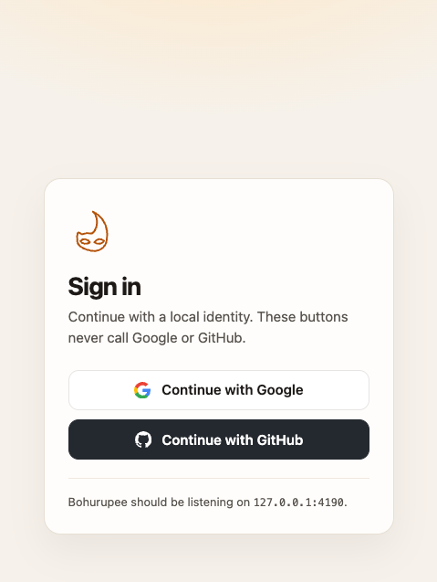
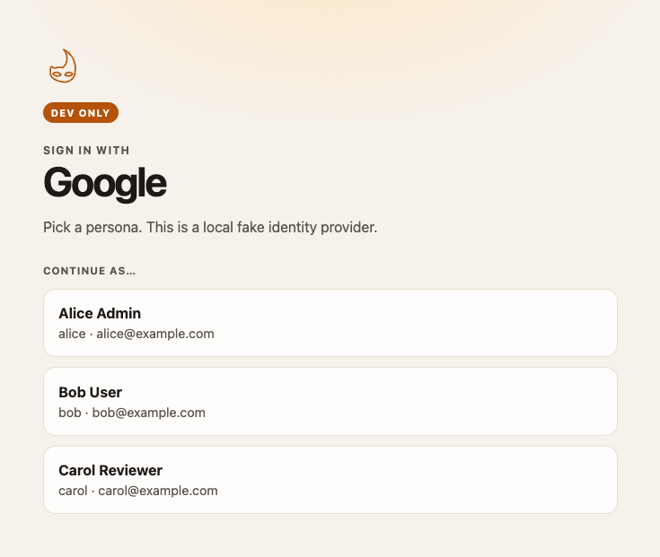

# milon/bohurupee-laravel

[](https://github.com/milon/bohurupee-laravel/actions/workflows/ci.yml)
[](LICENSE)

Optional [Laravel Socialite](https://laravel.com/docs/socialite) adapter for
[Bohurupee](https://github.com/milon/bohurupee). When enabled, `Socialite::driver()`
talks to a local Bohurupee process instead of Google, GitHub, or any other
remote IdP.

This package is **dev-only**. It refuses to boot when `APP_ENV=production`.

<p>
  
  
</p>

The screenshots are the [Socialite example](https://github.com/milon/bohurupee/tree/master/examples/laravel-socialite)
in the Bohurupee repo. The buttons never call Google or GitHub. Bohurupee
asks which persona to continue as, then Socialite receives that user.

## Requirements

- PHP 8.2 or newer
- Laravel 12 or 13 (`illuminate/support` ^12 or ^13)
- Laravel Socialite ^5.16
- A Bohurupee process, usually `http://127.0.0.1:4190`

## Install

```bash
composer require milon/bohurupee-laravel --dev
```

The service provider is auto-discovered. Start Bohurupee, then point the app at it:

```env
BOHURUPEE_ENABLED=true
BOHURUPEE_URL=http://127.0.0.1:4190
```

Keep the usual `config/services.php` client IDs and redirect URIs. Bohurupee
accepts any local secret.

Publish the config if you prefer PHP over env:

```bash
php artisan vendor:publish --tag=bohurupee-config
```

## Configure

| Variable | Default | Meaning |
|----------|---------|---------|
| `BOHURUPEE_ENABLED` | `false` | Wrap Socialite when `true` |
| `BOHURUPEE_URL` | `http://127.0.0.1:4190` | Bohurupee origin |
| `BOHURUPEE_DRIVERS` | empty | Comma-separated names to wrap. Empty wraps every `Socialite::driver($name)`, including custom slugs |
| `BOHURUPEE_EXCEPT` | empty | Names that stay on the real provider |

```env
BOHURUPEE_ENABLED=true
BOHURUPEE_URL=http://127.0.0.1:4190
# BOHURUPEE_DRIVERS=google,github
# BOHURUPEE_EXCEPT=apple
```

## Usage

Existing Socialite routes do not change. The factory returns a local provider
for each wrapped name:

```php
use Laravel\Socialite\Facades\Socialite;

Route::get('/login/{provider}', function (string $provider) {
    return Socialite::driver($provider)->redirect();
});

Route::get('/auth/{provider}/callback', function (string $provider) {
    $user = Socialite::driver($provider)->user();

    return [
        'id' => $user->getId(),
        'email' => $user->getEmail(),
        'name' => $user->getName(),
        'nickname' => $user->getNickname(),
        'avatar' => $user->getAvatar(),
    ];
});
```

Authorize, token, and userinfo are called on Bohurupee:

- `GET {BOHURUPEE_URL}/{driver}/authorize`
- `POST {BOHURUPEE_URL}/{driver}/token`
- `GET {BOHURUPEE_URL}/{driver}/userinfo`

Mapped fields, first match wins:

| Socialite | userinfo keys |
|-----------|----------------|
| `id` | `id`, `sub` |
| `email` | `email` |
| `name` | `name`, `display_name` |
| `nickname` | `nickname`, `login`, `preferred_username` |
| `avatar` | `picture.data.url`, `picture`, `avatar`, `profile_image_url`, `avatar_url` |

`$user->getRaw()` is the full userinfo JSON. Provider-shaped payloads are
documented in the Bohurupee repo at
[`docs/socialite.md`](https://github.com/milon/bohurupee/blob/master/docs/socialite.md).

## Production

If `BOHURUPEE_ENABLED=true` and `APP_ENV=production`, boot throws
`Milon\Bohurupee\ProductionForbiddenException`. Require the package as
`--dev` and leave the flag off in deployed environments.

## Tests

```bash
composer install
composer test
```

CI runs PHP 8.2–8.5 against Laravel 12 and 13. Tests mock HTTP, so they
never call a real provider.

From a sibling checkout, before the package is on Packagist:

```json
{
  "require-dev": {
    "milon/bohurupee-laravel": "@dev"
  },
  "repositories": [
    {
      "type": "path",
      "url": "../bohurupee-laravel"
    }
  ]
}
```
